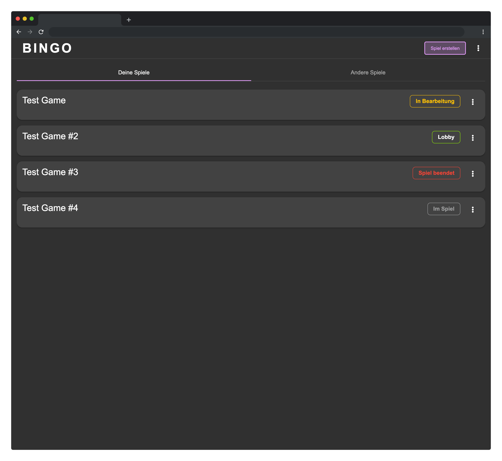
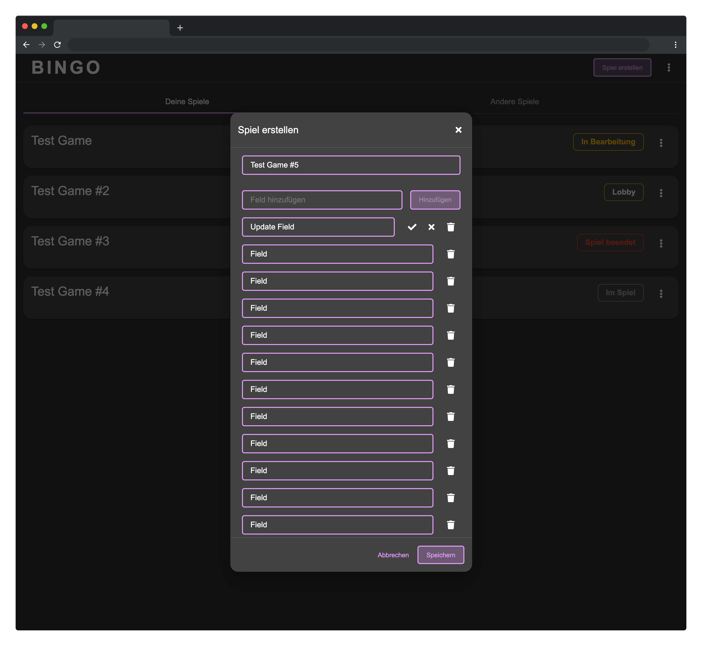
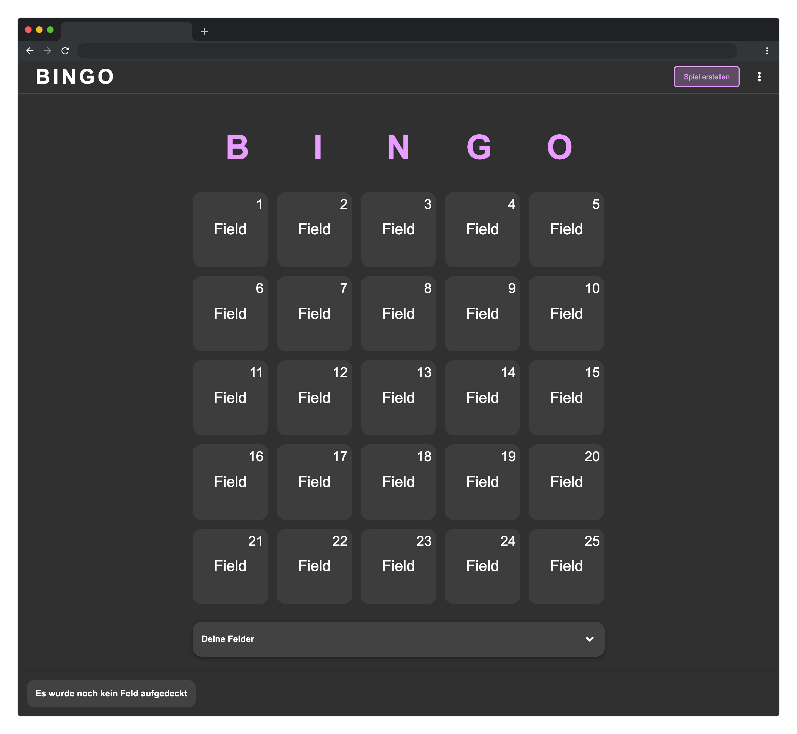

<center>
  
</center>

# Table of contents

- [Pre-Installation & Requirements](#Pre-Installation-&-Requirements)
- [Project Structure](#Project-Structure)
- [Tests](#Tests)
- [Common Commands](#Common-Commands)
  - [Backend](#Backend)
  - [Frontend](#Frontend)

# Pre-Installation & Requirements

In order to run the different apps the repository obvisously needs to get clone and the required packages must be installed via `npm install`. Besides that [Docker](https://www.docker.com/) and [Deno](https://deno.land/) are required in order to start the MongoDB and the backend. For more detailed informations about how to start the frontend and backend take a look into the [Common Commands](#Common-Commands) section.

```bash
$ git clone git@gitlab.mi.hdm-stuttgart.de:mwa/ss21/saturn.git
$ cd saturn
$ npm install
$ npm run backend:cache

$ npm install -g nx
```

Further more the whole project can be started and run with `docker-compose up` which elimates the requirement to install the node modules locally as well as the global [Nrwl Nx](https://nx.dev/) and [Deno](https://deno.land/) installation.

# Project Structure

The entire project is divided into different folders to ensure a generally clear structure. In order to achieve this goal [Nrwl Nx](https://nx.dev/) is used, which helps to architect, test, and build the applications and libraries. Additionally `Nx` enables us to manage the frontend and backend in a single workspace and share libraries accross each without any effort. The basic structure of the project is thus partially specified by `Nx` an looks as follows:

- **Apps:** The source, most of the configuration files as well as the unit and integration tests of the the frontend and backend are stored inside the `apps` folder. Both applications are divided into the equally named folders `frontend` and `backend`.
- **Libraries:** The `libs` folder contains everything that is shared across the frontend and backend (eg. the Interfaces and the GraphQL Mutations/Queries)
- **Tools:** The `tools` folder contains the `wait-for` script for our docker-compose setup as well as some database migrations which we used along the development.

# Tests

In the final state of the project, there are unit and integration tests for the backend and frontend. Those can be started either locally via `npm run backend:test` or `npm run frontend:test` or in a docker container by executing `docker-compose run backend ./test.sh` or `docker-compose run frontend ./test.sh`.

# CI/CD

# Common Commands

## Backend

| Name            | Description                                    |
| --------------- | ---------------------------------------------- |
| _backend:start_ | Starts the backend in development mode         |
| _backend:test_  | Runs the tests for the backend                 |
| _backend:cache_ | Downloads and caches the required Deno modules |

## Frontend

| Name             | Description                             |
| ---------------- | --------------------------------------- |
| _frontend:start_ | Starts the frontend in development mode |
| _frontend:test_  | Runs the tests for the frontend         |

# Screenshots






Icon made by Freepik from www.flaticon.com
